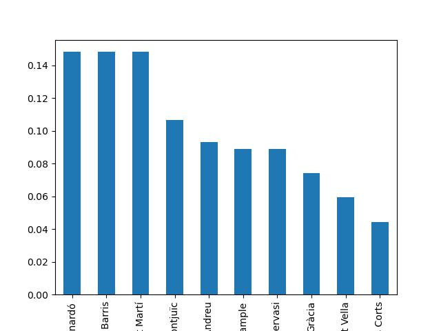

# PROJECTO 3
## INCREMENTO DE ALQUILERES EN LOS ULTIMOS 3 ANOS 

En este projecto analizare el incremento de precio en la ciudad de Barcelona y ver si este se ve afectado por un factor externo (COVID - TURISMO)

## HIPOTETIS:
El incremento en los alquileres se vio afectado en epoca de COVID - TURISMO

# DESARROLLO    
Para pode llegar a corrobroar mi hipotesis tomare 3 dataset del ayuntamiento de barcelona de los ultimos 3 años donde nos muestra los precios a lo largo de los meses.

Limpiare mostrare y graficare los datos mediante jupiternotebook-phyton.

Pasare el dataset limpio a SQL donde aplicare queries para vizualizar ciertos datos estadisticos de los valores

