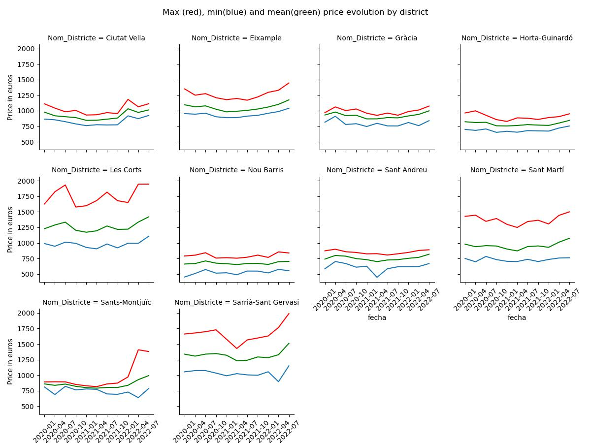

# PROYECTO 3
# EFECTOS DEL COVID Y EL TURISMO EN LOS ALQUILERES DE BARCELONA
# 

El turismo es uno de los factores que ha generado millonarios ingresos a esta ciudad catalana desde su auge tras los juegos olimpicos en el 92, aproximadamente un promedio 7,45 millones de turistas acuden a la ciudad cada año desde los ultimos 10 años, pero durante y tras la pandemia del COVID-19 Barcelona se vio afectada por cierre de su comercio y actividades causando asi una gran caida en el flujo turistico. 

Como bien se sabe los alquileres en la ciudad son famosos por su altos precios debido a la gran cantidad tanto de estudiantes como de turistas que acuden cada año a la ciudad, en este proyecto veremos como el valor en los alquileres cambiaron tras el estado de alarma y que cambios hubo en su valor promedio antes de la pandemia.

#  
## 1. OBJETIVO:
Intentaremos mostrar que el precio del alquiler en barcelona fluctuo acorde al nivel de turismo en la ciudad

#
## 2. ARCHIVOS:
En la carpeta mycodes se encontrara archivos .ipynb donde se ve los datos limpios y .sql donde podremos ver datos estadisticos del mismo 

## 3. DESARROLLO:

El proceso para llegar a un dataset limpio fue el siguiente
* Importe librerias necesarias
  

* Importe dataset de el año 2020, 2021, 2022
* Concatene estos 3 datasets para tener un unico
  

* Cree una columa mas adecuada para mis procesos en formato de fecha
* limpiar datos irrelavantes para mi investigacion ( €/ metros cuadrato, valores nulos)
* Converti la columna Preu a float ya the estaba como string
* Cree graficas para vizualizar los datos de manera mas facil segun distrito 
* Realize una preuba estadistica para ver si los datos estaban en una serie estacionaria o no
* Calcule porcetanjes de variacion en los precios
* Importe data set limpio a SQL donde aplique alguna queries para facilitar la vizualizacion 

## 4. VISUALIZACIONES:
GRAFICOS RELEVANTES :

* Separe vizualmente los maximos, minimos y media en una linea de tiempo por cada distrito 

* Este grafico muestra la media del precio en alquileres en tota la ciudad de barcelona a lo largo de los 3 años 

## 5. DATOS ESTADISTICOS 

En general
* Segun los datos finales podemos ver que los valores siguen una tendencia no estacionaria con un valor de  0.8000437765486774

* El porcentaje de incremento en total en toda la ciudad fue de : 6.79%

El porcentaje de incremento varia segun el distrito:
* Ciutat Vella', 4.32%
* Eixample', 6.12%
* Sants-Montjuïc', 8.11%
* Les Corts', 12.47%
* Sarrià-Sant Gervasi', 11.63%
* Gràcia', 7.15%
* Horta-Guinardó', 3.26%
* Nou Barris', 2.52%
* Sant Andreu', 9.77%
* Sant Martí', 16.54%

## 6. CONCLUSIONES:
Segun los datos obtenidos tras la limpieza y los calculos realizados vemos que los precios de los alquileres cayeron sobre la mitad del año 2020 el cual aun estaba las secuelas de la pandemia, esta caida continuo fuertemente hasta 1 año mas adelante 2021 donde ya la pandemia estaba casi en su totalidad controlada y el turismo volvio en olas gigantes a la ciudad, y hasta hoy en dia este precio sigue disparandose a niveles extremos

Lo cual corroborra mi hipotesis mencionada al comienzo de la investigacion:

El precio de los alquileres esta ligado al flujo de turistas y estudiantes en la ciudad, es un problema que esta generando una burbuja de precios respecto a la vivienda y que los locales en la ciudad se estan viendo bastante afectados.

## 7. RECURSOS:
https://opendata-ajuntament.barcelona.cat/data/es/dataset
 -- DATASETS --

https://www.idealista.com/sala-de-prensa/informes-precio-vivienda/alquiler/cataluna/barcelona-provincia/
-- DATOS ESTADISTICOS -- 

https://es.statista.com/estadisticas/480611/numero-de-turistas-alojados-en-hoteles-barcelona-espana/#:~:text=En%202022%2C%20el%20n%C3%BAmero%20de,de%20siete%20millones%20en%202022.
-- DATOS ESTADISTICOS --